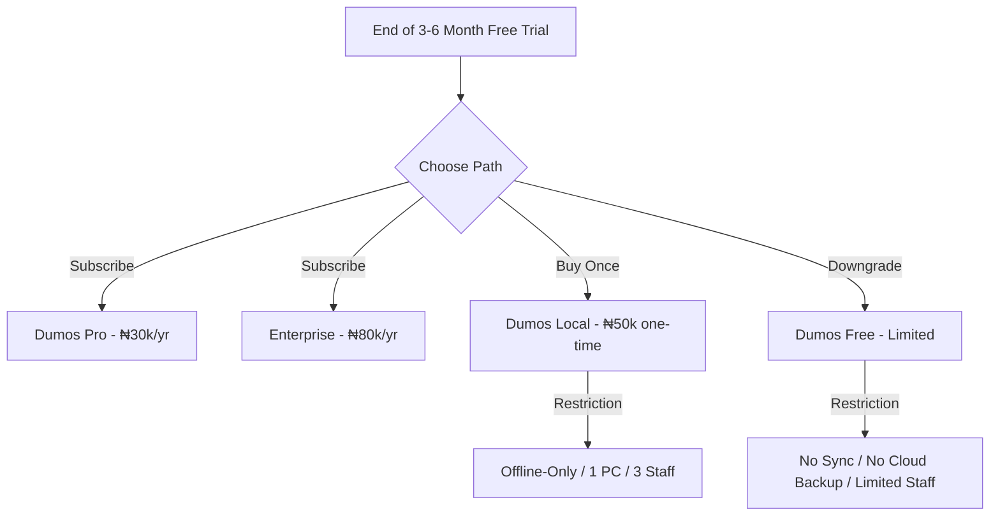

# DumosRx Go-To-Market (GTM) & Launch Strategy

This document outlines the commercial rollout, penetration pricing model, testing cycles, and lead pipeline for **DumosRx**. It serves as our operational blueprint to transition from beta testing to a commercial launch in the Nigerian pharmacy software market.

---

## 1. Penetration Pricing & Lifecycle Model

To win early trust and rapidly capture market share, DumosRx will deploy a **Penetration Pricing Campaign** targeted at selected early adopters.

### Launch Campaign: The 3-6 Month Free Trial
* **The Offer**: Selected early adopters receive **3 to 6 months of Dumos Pro or Enterprise features for free**.
* **Objective**: Establish DumosRx as their primary operating system, making it indispensable before any payment conversation.
* **Onboarding Friction Reduction**: No card setup required for the trial. Activation is automated upon initial local sync.

### Post-Trial Conversion Lifecycle
After the trial period expires, users are presented with three paths:



1. **Option A: Subscribe to Dumos Pro (₦30,000/year)**
   * Retains full cloud capabilities: Auto cloud backups, remote web dashboard access, and mobile/multi-device sync.
2. **Option B: Downgrade to Dumos Local (₦50,000 one-time fee)**
   * For shops that refuse subscriptions. 
   * **Technical limitation**: We lock the app to **offline-only**, 1 PC installation, and max 3 staff accounts. They must perform exactly one online sync to register the offline license token, after which they can run offline indefinitely.
3. **Option C: Downgrade to Free Tier**
   * Heavily restricted: No cloud synchronization, no backup/restore support, max 1 staff account, and limited reports. This keeps their database accessible (they don't lose their data), but cuts off the advanced ERP value.

### UX of Subscription Transitions
* **Countdown Banners**: A non-intrusive alert banner appears in the top navigation panel starting **30 days before trial expiry** (e.g., *"Your Dumos Pro trial expires in 12 days. Subscribe now to keep cloud sync active."*).
* **Grace Period**: Give a **7-day soft grace period** after expiry where sync still runs but warnings become prominent.
* **Downgrade Notice**: If they choose the Free or Local tier, show a clear confirmation modal explaining what data will remain locally and what features (like cloud sync and remote dashboards) will be disabled.

---

## 2. Structured Quality Assurance & UX Blueprint

Pharmacists and sales assistants are often not computer-literate. If the POS lags, freezes, or fails to sync, cashiers will immediately revert to paper ledgers or legacy POS systems. **UX simplicity and absolute reliability are our primary retention engines.**

### "Zero-Friction" UX Principles for Non-Tech-Savvy Users
1. **Large, Tap-Friendly Target Zones**: Ensure POS buttons (checkout, payment methods, search bar) have generous padding and are easy to click on tablets or mobile phones.
2. **Keyboard-Only POS Checkout**: Cashiers should be able to complete a sale using only the keyboard (`Enter` to checkout, `C` for Cash, `T` for Transfer, arrow keys to select, etc.) for high-speed operation.
3. **Zero-Latency Feedback**: POS operations must feel instantaneous. SQLite reads/writes must be optimized, and sync operations must happen strictly in the background without locking the UI.
4. **Resilient Sync Feedback**: A prominent, simple sync indicator in the header (e.g., a green dot for "Saved & Synced", blue for "Saved Offline", orange for "Syncing..."). Avoid displaying complex error stack traces to cashiers; show simple, actionable messages (e.g., *"Internet connection slow. DumosRx is working offline and will sync automatically when connection improves."*).

### The Five-Phase Feedback Loop
To ensure every flow is seamless and robust, we will execute our testing in strict stages:

```
[Phase 1: Developer QA] ➔ [Phase 2: Expert Review] ➔ [Phase 3: Paid Cashier Simulation] ➔ [Phase 4: Select Pilot Rollout] ➔ [Phase 5: Scale]
```

* **Phase 1: Developer QA & Bug Squashing (Current)**
  * **Objective**: Fix existing bugs, optimize SQLite queries, and test database schema synchronization edge cases.
* **Phase 2: Expert Pharmacist Review**
  * **Testers**: Chisom RH & Mmesoma RH (both have hands-on experience with Barsoft and VirtualRx).
  * **Goal**: Validate that the POS layout, medicine entry, and inventory flow match real-world pharmacy speed and expectations. Gather feedback on differences between DumosRx and legacy tools.
* **Phase 3: Paid Cashier Simulation (Nest Pharmacy)**
  * **Testers**: Hire 1-2 Cashiers/Nurses from Nest Pharmacy (Pay ₦5,000 for 1–2 weeks of active testing).
  * **Goal**: Observe them using the app *without guiding them*. Identify onboarding friction points, confusing buttons, or flow blockers for computer-illiterate users.
* **Phase 4: Select Pilot Rollout (3-6 Months Free Trial)**
  * **Testers**: Umueze Pharmacy (Android) and Cynthia Adaeze / Nest Pharmacy (QuickBooks migration).
  * **Goal**: Live business operations. Verify database integrity, sync stability, and user retention.
* **Phase 5: Commercial Proposals & Scaling**
  * **Target**: Makhillz Pharmacy (2+ stores), Betacure (Sienne), DotCom (Ikem/Gloria).

---

## 3. Product Suggestions & Suggestion System Data

DumosRx's **Smart Suggestions Engine** must help pharmacists upsell and provide better clinical advice. To seed the rule-based suggestions system, we need to curate clinical and sales correlation pairings.

### Core Data Categories to Seed
* **Clinical Co-Purchases**:
  * Antibiotics (e.g., Amoxicillin, Ciprofloxacin) ➔ Probiotics (to prevent diarrhea).
  * Antimalarials (e.g., Artemether/Lumefantrine) ➔ Vitamin C, Multivitamins, or Paracetamol.
  * Antihypertensives (e.g., Amlodipine, Lisinopril) ➔ Potassium supplements or Omega-3.
* **Sales Co-Purchases**:
  * Cough Syrups ➔ Throat lozenges or tissues.
  * Baby Diapers ➔ Baby wipes or baby oil.

### Data Collection & Implementation Flow
1. **Initial Seed Script**: We will bundle a predefined seed file (`suggestions_seed.sql`) containing standard therapeutic pairings.
2. **Local Machine Learning (Post-Launch)**: In Phase 2, the `SuggestionsEngine` will query local transaction history to find items with high co-occurrence support and confidence scores, adapting dynamically to what each shop's customers buy together.

---

## 4. Lead Pipeline & Blocker Matrix

Below is our current prospect pipeline, mapped to their specific requirements and technical launch blockers.

| Lead / Prospect | Current System | Strategic Pitch / Offer | Technical Launch Blocker | Action Owner |
| :--- | :--- | :--- | :--- | :--- |
| **Chisom RH** | Barsoft, VirtualRx | Expert Beta Tester. Ask for detailed POS UX feedback. | None (Desktop Tauri Web app) | Primary Dev |
| **Mmesoma RH** | Barsoft, VirtualRx | Expert Beta Tester. Compare layout & speeds. | None (Desktop Tauri Web app) | Primary Dev |
| **Nest Cashiers** | QuickBooks | Paid testing (₦5k/week). Run POS speed tests. | None | Primary Dev |
| **Umueze Pharmacy** | None / Paper | **3-6 Months Free**. Mobile phone setup. | **Android App Build** (Must package React/Tauri or web app wrapper to Android APK). | Primary Dev |
| **Cynthia Adaeze** (Nest Pharmacy Owner) | QuickBooks (Active) | **3-6 Months Free**. Ask for QuickBooks feature gaps. Confirm pricing. | **QuickBooks Import/Migration tool** | Primary Dev |
| **Ben Umembaoma** | None (Perfume) | Standard launch offer. Pivot POS templates for general retail inventory. | POS General Retail Template support | Primary Dev |
| **Sienne** (Betacure) | Legacy Inventory | Pitch Shopify/WooCommerce sync to pull them off legacy app. | **E-commerce Sync Layer** (WooCommerce/Shopify API) | Primary Dev |
| **Mmesoma** (Former Apprentice) | Legacy Inventory | E-commerce integration benefits. | **E-commerce Sync Layer** | Primary Dev |
| **Makhillz Pharmacy** (2+ stores) | QuickBooks | 2+ store aggregated dashboard. | **Enterprise Multi-Store Sync** | Co-Founder Mike |
| **Ikem/Gloria** (DotCom) | Scope Shopmaster | Pitch missing features they wish Scope had. | Feature Gap Analysis | Primary Dev |

---

## 5. Domain, Hosting, and Infrastructure Decisions

### Domain Strategy: `dumosrx.com`
> [!IMPORTANT]
> **Decision: Purchase `dumosrx.com` IMMEDIATELY.**
> * **Cost**: Negligible (~$10–$15 per year).
> * **Security & Prevention**: Prevents domain squatting by competitors or domain brokers once marketing or public testing begins.
> * **Professionalism**: Setting up `sales@dumosrx.com` or `support@dumosrx.com` is essential when approaching bigger chains like Makhillz Pharmacy or Betacure.
> * **Action**: Register the domain now, point the name servers to your current cPanel web server, and redirect it to the app registration page.

### Hosting & VPS Migration Plan
* **Short-Term (Beta & Launch)**: Remain on the **cPanel Shared Hosting**. This keeps overhead costs at ₦0/month while we gather user feedback. The current sync controller is lightweight enough to support 5–10 concurrent pharmacies.
* **Medium-Term (Scale Phase - 20+ Pharmacies)**: Migrate to a dedicated **VPS (Virtual Private Server)** (e.g., DigitalOcean, Linode, or Hetzner).
  * **Why VPS is necessary later**:
    * Shared cPanel hosting restricts web socket connections, limiting live multi-device POS updates.
    * Shared servers have low PHP request execution limits, which can block large batch sync operations.
    * VPS allows setting up robust database clustering and cron-backed automated backups.
  * **Trigger for Migration**: Reaching 15–20 active paying pharmacies, or when database sync latency exceeds 2 seconds during peak hours.
