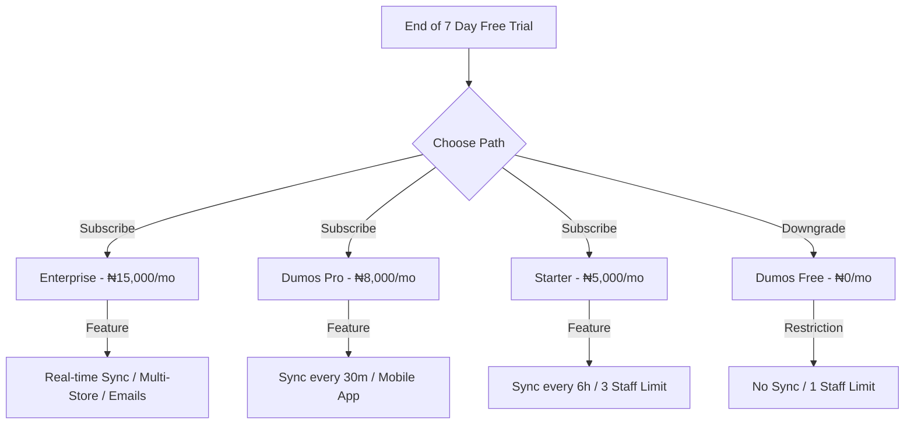

# DumosRx Go-To-Market (GTM) & Launch Strategy

This document outlines the commercial rollout, penetration pricing model, testing cycles, and lead pipeline for **DumosRx**. It serves as our operational blueprint to transition from beta testing to a commercial launch in the Nigerian store software market.

---

## Competitive Landscape

To effectively penetrate the market, DumosRx must position itself against the following established players and alternatives:
* **Shop Kite (https://shopkite.com.ng/)**: A modern Nigerian retail and pharmacy POS competitor.
* **Monepay (Unconfirmed exact name)**: A newer POS system reportedly being adopted by larger stores (like Makhillz).
* **VirtualRx**: A legacy local pharmacy POS competitor with an established footprint.
* **Barsoft**: Another legacy pharmacy POS previously used by stores like Right Health before migrating to VirtualRx.
* **Cracked QuickBooks 2013**: Highly prevalent among local retail stores; users avoid subscription fees but suffer from lack of cloud sync and dedicated pharmacy modules.

---

## 1. Penetration Pricing & Lifecycle Model

To win early trust and rapidly capture market share, DumosRx will deploy a **Penetration Pricing Campaign** targeted at selected early adopters.

### Launch Campaign: The 7-Day Free Trial
* **The Offer**: Selected early adopters receive **7 days of Dumos Pro features for free**.
* **Objective**: Establish DumosRx as their primary operating system, making it indispensable before any payment conversation.
* **Onboarding Friction Reduction**: No card setup required for the trial. Activation is automated upon initial local sync.

### Post-Trial Conversion Lifecycle
After the trial period expires, users are presented with three paths:



1. **Option A: Subscribe to a Paid Tier**
   * **Enterprise (₦15,000/mo)**: Unlimited multi-device access. Real-time/instant cloud sync and backups. Includes priority email alerts.
   * **Dumos Pro (₦8,000/mo)**: Desktop + Mobile App + Full Web Dashboard (sync every 30 minutes). Max 10 staff accounts.
   * **Starter (₦5,000/mo or ₦50,000/yr)**: Desktop host + up to 2 local network clients. Cloud sync limited to once every 6 hours. Max 3 staff accounts.
2. **Option B: Downgrade to Free Tier (₦0/mo)**
   * Heavily restricted: No cloud synchronization, no backup/restore support, max 1 staff account, and limited reports. This keeps their database accessible (they don't lose their data), but cuts off the advanced ERP value.

### UX of Subscription Transitions
* **Countdown Banners**: A non-intrusive alert banner appears in the top navigation panel starting **3 days before trial expiry** (e.g., *"Your Dumos Pro trial expires in 3 days. Subscribe now to keep cloud sync active."*).
* **Grace Period**: Give a **7-day soft grace period** after expiry where sync still runs but warnings become prominent.
* **Downgrade Notice**: If they fall to the Free tier, show a clear confirmation modal explaining what data will remain locally and what features (like cloud sync and remote dashboards) are disabled.

---

## 2. Structured Quality Assurance & UX Blueprint

Retailers and sales assistants are often not computer-literate. If the POS lags, freezes, or fails to sync, cashiers will immediately revert to paper ledgers or legacy POS systems. **UX simplicity and absolute reliability are our primary retention engines.**

### "Zero-Friction" UX Principles for Non-Tech-Savvy Users
1. **Large, Tap-Friendly Target Zones**: Ensure POS buttons (checkout, payment methods, search bar) have generous padding and are easy to click on tablets or mobile phones.
2. **Keyboard-Only POS Checkout**: Cashiers should be able to complete a sale using only the keyboard (`Enter` to checkout, `C` for Cash, `T` for Transfer, arrow keys to select, etc.) for high-speed operation.
3. **Zero-Latency Feedback**: POS operations must feel instantaneous. SQLite reads/writes must be optimized, and sync operations must happen strictly in the background without locking the UI.
4. **Resilient Sync Feedback**: A prominent, simple sync indicator in the header (e.g., a green dot for "Saved & Synced", blue for "Saved Offline", orange for "Syncing..."). Avoid displaying complex error stack traces to cashiers; show simple, actionable messages (e.g., *"Internet connection slow. DumosRx is working offline and will sync automatically when connection improves."*).

### The Five-Phase Feedback Loop
To ensure every flow is seamless and robust, we will execute our testing in strict stages:

```
[Phase 1: Developer QA] ➔ [Phase 2: Expert Review] ➔ [Phase 3: Paid Cashier Simulation] ➔ [Phase 4: Select Pilot Rollout] ➔ [Phase 5: Scale]
```

* **Phase 1: Developer QA & Bug Squashing (Current)**
  * **Objective**: Fix existing bugs, optimize SQLite queries, and test database schema synchronization edge cases.
* **Phase 2: Expert Retailer Review**
  * **Testers**: Chisom RH & Mmesoma RH (both have hands-on experience with Barsoft and VirtualRx).
  * **Goal**: Validate that the POS layout, medicine entry, and inventory flow match real-world store speed and expectations. Gather feedback on differences between DumosRx and legacy tools.
* **Phase 3: Paid Cashier Simulation (Nest store)**
  * **Testers**: Hire 1-2 Cashiers/Nurses from Nest store (Pay ₦5,000 for 1–2 weeks of active testing).
  * **Goal**: Observe them using the app *without guiding them*. Identify onboarding friction points, confusing buttons, or flow blockers for computer-illiterate users.
* **Phase 4: Select Pilot Rollout (3-6 Months Free Trial)**
  * **Testers**: Umueze store (Android) and Cynthia Adaeze / Nest store (QuickBooks migration).
  * **Goal**: Live business operations. Verify database integrity, sync stability, and user retention.
* **Phase 5: Commercial Proposals & Scaling**
  * **Target**: Makhillz store (2+ stores), Betacure (Sienne), DotCom (Ikem/Gloria).

---

## 3. Product Suggestions & Suggestion System Data

DumosRx's **Smart Suggestions Engine** helps retailers upsell and provide better clinical advice.

### Technical Implementation of Suggestions
To keep the application fast and offline-resilient, suggestions run entirely client-side:
1. **Trigger Engine**: We match the items currently in the cart against target recommendation categories. For example:
   * `Antimalarials` ➔ Recommends `Vitamins` and `Analgesics` (e.g., Vitamin C, Paracetamol).
   * `Antibiotics` ➔ Recommends `Vitamins` (e.g., Probiotics, B-complex).
   * `Cough & Cold` ➔ Recommends `Vitamins`.
   * `Analgesics` (NSAIDs) ➔ Recommends `Antacids`.
2. **Suggestions Hook ([useSmartSuggestions.ts](file:///Users/admin/Documents/Projects/DumosRx/client/hooks/use-smart-suggestions.ts))**:
   * Listens to the local POS cart state.
   * Extracts the categories of products in the cart.
   * Queries local SQLite `medicines` to verify if matching products are currently in stock (`stock_quantity > 0` and `is_active = 1` and `_deleted = 0`).
   * Filters out any suggested items that are *already in the cart*.
3. **UI Integration ([POSSuggestions](file:///Users/admin/Documents/Projects/DumosRx/client/components/pos/pos-suggestions.tsx))**:
   * Renders a beautiful, dashed card in the POS checkout sidebar listing the top suggestions.
   * Includes a one-click "Add" button that instantly appends the item to the cart.

### Core Data Categories to Seed
* **Clinical Co-Purchases**:
  * Antibiotics (e.g., Amoxicillin, Ciprofloxacin) ➔ Probiotics (to prevent diarrhea).
  * Antimalarials (e.g., Artemether/Lumefantrine) ➔ Vitamin C, Multivitamins, or Paracetamol.
  * Antihypertensives (e.g., Amlodipine, Lisinopril) ➔ Potassium supplements or Omega-3.
* **Sales Co-Purchases**:
  * Cough Syrups ➔ Throat lozenges or tissues.
  * Baby Diapers ➔ Baby wipes or baby oil.

### Data Collection & Implementation Flow
1. **Initial Seed Script**: We will bundle a predefined seed file (`suggestions_seed.sql`) containing standard therapeutic pairings.
2. **Local Machine Learning (Post-Launch)**: In Phase 2, the `SuggestionsEngine` will query local transaction history to find items with high co-occurrence support and confidence scores, adapting dynamically to what each shop's customers buy together.


---

## 4. Lead Pipeline & Blocker Matrix

Below is our current prospect pipeline, mapped to their specific requirements and technical launch blockers.

| Lead / Prospect | Current System | Strategic Pitch / Offer | Technical Launch Blocker | Action Owner |
| :--- | :--- | :--- | :--- | :--- |
| **Chisom RH** | Barsoft, VirtualRx | Expert Beta Tester. Ask for detailed POS UX feedback. | None (Desktop Tauri Web app) | Primary Dev |
| **Mmesoma RH** | Barsoft, VirtualRx | Expert Beta Tester. Compare layout & speeds. | None (Desktop Tauri Web app) | Primary Dev |
| **Nest Cashiers** | QuickBooks | Paid testing (₦5k/week). Run POS speed tests. | None | Primary Dev |
| **Umueze store** | None / Paper | **3-6 Months Free**. Mobile phone setup. | **Android App Build** | Primary Dev |
| **Cynthia Adaeze** (Nest store Owner) | QuickBooks (Active) | **3-6 Months Free**. Ask for QuickBooks feature gaps. Confirm pricing. | **QuickBooks Import/Migration tool** | Primary Dev |
| **Ben Umembaoma** | None (Perfume) | Standard launch offer. Pivot POS templates for general retail inventory. | POS General Retail Template support | Primary Dev |
| **Sienne** (Betacure) | Legacy Inventory | Pitch Shopify/WooCommerce sync to pull them off legacy app. | **E-commerce Sync Layer** (WooCommerce/Shopify API) | Primary Dev |
| **Mmesoma** (Former Apprentice) | Legacy Inventory | E-commerce integration benefits. | **E-commerce Sync Layer** | Primary Dev |
| **Makhillz store** (2+ stores) | QuickBooks | 2+ store aggregated dashboard. | **Enterprise Multi-Store Sync** | Co-Founder Mike |
| **Ikem/Gloria** (DotCom) | Scope Shopmaster | Pitch missing features they wish Scope had. | Feature Gap Analysis | Primary Dev |
| **Pharm KC** (Shemuel Pharmacies) | Unknown (Past Owner) | Indirect (WhatsApp Stories) -> Ask for direct interest or network referrals | None | Primary Dev |

### Technical Strategy for Major Feature Blockers

#### A. Android APK & PWA Release Flow
For mobile-only users (like Umueze store) and iOS users (who don't use PCs):
1. **Android Compilation (Tauri v2 Mobile)**: We will utilize Tauri's built-in mobile support to bundle the Next.js client directly into an Android package (`.apk`).
2. **PWA (Progressive Web App) Route (For iOS/iPhone)**:
   * **Why**: Publishing to the iOS App Store is slow, requires a $99/year developer account, and has high friction.
   * **How**: We will add a Web App Manifest (`manifest.json`), service workers, and iOS-specific meta tags to the Next.js project.
   * **UX**: iOS users open the app in Safari, tap "Add to Home Screen," and run it as a full-screen standalone application. Because it utilizes the browser's local storage/IndexedDB for the offline-first SQLite database, it operates identically to the desktop client with zero App Store friction.

#### B. E-Commerce Integration (Online Branch)
For clients like Betacure (Sienne) who require an online presence to migrate:
1. **Option A: Third-Party API Sync (WooCommerce/Shopify)**:
   * Build a synchronization service in the Laravel server.
   * When product quantity changes on DumosRx, trigger an API payload to WooCommerce (`PUT /wp-json/wc/v3/products/<id>`) or Shopify to update stock counts.
2. **Option B: Hosted DumosRx Storefront (Recommended)**:
   * Instead of sync with WooCommerce/Shopify, we offer a built-in storefront (e.g. `betacure.dumosrx.com` or custom domain mapping) hosted on our server.
   * **Why it's better**: Zero maintenance of third-party plugins, unified subscription pricing, and keeps the store locked into the DumosRx ecosystem. We will build WooCommerce/Shopify sync as a migration bridge but upsell them to the hosted storefront.

---

## 5. Domain, Hosting, and Infrastructure Decisions

### Domain Strategy: `dumosrx.com`
> [!NOTE]
> **Status: Domain `dumosrx.com` successfully purchased and configured.**
> * The app is now hosted entirely on `dumosrx.com`.
> * Namecheap DNS and cPanel have been fully integrated.
> * Required CORS policies have been updated to support `https://dumosrx.com` and its subdomains.
> * Professional emails (e.g., `sales@dumosrx.com` and `support@dumosrx.com`) can now be utilized.

### Hosting & VPS Migration Plan
* **Short-Term (Beta & Launch)**: Remain on the **cPanel Shared Hosting**. This keeps overhead costs at ₦0/month while we gather user feedback. The current sync controller is lightweight enough to support 5–10 concurrent stores.
* **Medium-Term (Scale Phase - 20+ stores)**: Migrate to a dedicated **VPS (Virtual Private Server)** (e.g., DigitalOcean, Linode, or Hetzner).
  * **Why VPS is necessary later**:
    * Shared cPanel hosting restricts web socket connections, limiting live multi-device POS updates.
    * Shared servers have low PHP request execution limits, which can block large batch sync operations.
    * VPS allows setting up robust database clustering and cron-backed automated backups.
  * **Trigger for Migration**: Reaching 15–20 active paying stores, or when database sync latency exceeds 2 seconds during peak hours.

