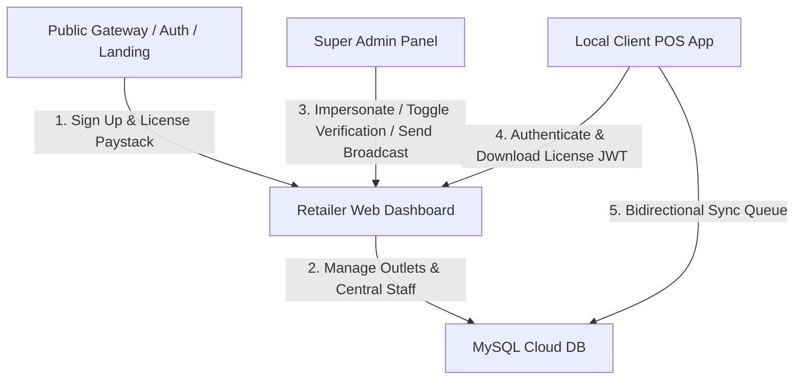

# 📖 DumosRx: System Features & Integration Documentation

This document provides a detailed overview of the **DumosRx** system. It explains every core feature, module, and user flow, and documents how the **Public Gateway**, **Retailer Web Dashboard**, **Local POS Client**, and **Super Admin Dashboard** connect and interact.

---

## 🏗️ 1. Architecture Overview & Core Philosophy

DumosRx is designed as a **hybrid, offline-first SaaS**. 

1. **Local Client POS (Independent Node):** The operational core. Runs POS, stock catalogs, audits, customer profiles, and prescriptions on a local SQLite database. It continues to process sales and manage inventory independently even if the store loses internet connectivity.
2. **Retailer Web Dashboard (Store HQ):** The management and billing control center. Allows store owners to purchase subscriptions, generate licenses, configure multiple outlets (fleet), and manage staff credentials.
3. **Platform Super Admin (Governance Hub):** The central management portal for platform owners to control pricing, monitor system health, impersonate accounts for support, edit transaction emails, and configure global toggles.
4. **Public Gateway (Landing & Auth):** The entry point. Handles pricing transparency, downloads distribution, registration, and email verification.

---

## 🌐 2. Public Gateway & Auth Flows

The public site serves as the storefront and entry gateway. It contains marketing landing pages, legal/support documentation, user registration, and authentication actions.

### 2.1 Component Features
*   **Landing Page (`/`):** Pricing grids showing feature differences across subscription tiers (Free, Starter, Pro, Enterprise).
*   **Downloads Center (`/downloads`):** Fetches release metadata from GitHub API and serves installation binaries for Windows, macOS, Linux, and Android.
*   **Authentication Gateway:**
    *   **Register (`/register`):** Collects store metadata and admin parameters. Validates unique usernames and emails. Inserts a default 14-Day Pro Trial subscription.
    *   **Login (`/login`):** authenticates users, tracks device fingerprints (IP, User Agent), and sends "New Device Alert" emails for suspicious logins.
    *   **Forgot/Reset Password:** Generates signed reset URLs that expire in 60 minutes.
    *   **Verify Email Landing (`/verify-email`):** Handles incoming link clicks, calls the backend, updates `email_verified_at` column, and redirects to the dashboard.

### 🔗 Integration Points
*   **Ties to Retailer Web Dashboard:** Once registration succeeds, a token is issued and stored in LocalStorage (`drx_token`). The user is immediately redirected to the dashboard's `/dashboard/overview` page.
*   **Ties to Super Admin Dashboard:** If the Super Admin toggles **Require Email Verification** to `ON`, any new registration via the public signup form will immediately flag the user's account as unverified. This pushes a verification banner to their web dashboard and blocks POS synchronisation.
*   **Ties to Local Client:** The login credentials created on the registration page are used by the local desktop client during the "Quick Setup Wizard" to link the local SQLite instance to the cloud databases.

---

## 📈 3. Retailer / Store Owner Web Dashboard (Store HQ)

The Web Dashboard allows store owners (Retailers) to manage their business operations, fleet, subscriptions, and staff in the cloud.

### 3.1 Component Features
*   **Dashboard Overview:** Displays aggregate statistics (Total Sales, Stock Value, Connected Devices) and charts (Sales growth trends, synchronization logs).
*   **Fleet / Outlets Management (`/dashboard/fleet`):**
    *   Registers new store outlets (creates unique device prefixes like `WEB-XXXX`).
    *   Tracks live synchronization status (logs when each local client last checked in).
*   **Staff Registry (`/dashboard/staff`):**
    *   Central directory for all store cashiers, pharmacists, and managers.
    *   Assigns granular roles and sets the **4-digit login PINs** for the local terminal apps.
*   **Billing & Subscriptions (`/dashboard/billing`):**
    *   Paystack payment integration for subscription packages.
    *   Coupon validation module for discounts.
    *   **License JWT Token Generator:** Signs a secure key containing the subscription tier, active expiration date, and cashier seat limits. This key is used by the local client to unlock offline premium modules.
*   **Referrals Program:** Exposes unique referral codes (`DRX-XXXXXX`) and logs earned/spent credits.
*   **Sessions & Security:** Lists active session details (location, browser, IP) and allows revoking tokens (logout all devices).
*   **Danger Zone:** Handles account deletion requests and deletion cancellations.

### 🔗 Integration Points
*   **Ties to Local Client:** 
    *   Cashier profiles and their 4-digit PINs created on this dashboard are pushed to the database, where the local client downloads them during the next sync loop.
    *   The JWT License generated in the billing tab is copied and pasted into the local client to validate subscription tiers and verify offline integrity.
*   **Ties to Super Admin Panel:** If a store owner files a support ticket, the Super Admin can click **Impersonate** in the admin panel. This logs the admin directly into the Retailer Web Dashboard layout, allowing them to troubleshoot settings without asking for the owner's password.

---

## 💻 4. Local Client Desktop Application (Offline POS)

The Local Client is a hybrid web/native desktop app (packaged via Tauri/Electron) built to run offline. Each client acts as an independent node with its own local SQLite database, removing the need for complex local networks (LAN).

### 4.1 Component Features
*   **Quick Setup Wizard:** Guides first-time setup (restores from a `.drx` backup file, links to cloud APIs via JWT, or defaults to offline-only Free mode).
*   **Terminal PIN Login:** Cashiers select their profile and input their 4-digit login PIN. Validates offline.
*   **POS Module:**
    *   Fast catalog search, barcode camera/hardware scanner.
    *   Shopping cart, customer CRM selector (shows chronic disease warnings).
    *   **Smart Suggestions:** Client-side SQL engine that recommends therapeutic cross-sells (e.g. suggesting Vitamin C when Antibiotics are in the cart).
    *   Park/Hold transactions queue.
    *   Split-payments checkout (Cash, Card, Transfer), Naira change calculator.
    *   Custom thermal receipt generation.
*   **Inventory & Batch Ledger:**
    *   Manages medicine catalog entries (Generic name, brand name, strength, pack size, NAFDAC regulatory compliance numbers).
    *   Adjusts stock levels (write-off log: lost, stolen, damaged, audit variance).
    *   Purchase Orders: Generates procurement documents. Fulfilled POs auto-increment local inventory counts and log batch numbers and expiries.
    *   Audits module to track discrepancies.
*   **Clinical Prescriptions Registry:** Creates prescription records and refills queues. Chronic patient refill reminders alert cashiers during checkouts.
*   **Expenses Ledger:** Category tracking.
*   **EOD Shift Closure:** Cashiers must count drawer cash, card receipts, and bank transfers, contrast with computed POS totals, explain variances, and close the shift registry.
*   **Local Backups:** Export/Import full `.drx` files and run QuickBooks 2013 CSV catalog imports.

### 🔗 Integration Points
*   **Ties to Retailer Web Dashboard (Sync Engine):**
    *   **Push:** Any local change (new sales, return records, stock adjustments, shift closures) is written to a `_sync_queue` table and transmitted via `/sync/push` to merge into the central MySQL database.
    *   **Pull:** Every sync interval, each independent client requests data updates from `/sync/pull` since the last timestamp, pulling down new catalog items, staff profiles, and modified PIN configurations.
*   **Ties to Public Gateway:** The app downloads are served via the public portal, which locks downloads if the account is unverified.
*   **Ties to Super Admin Dashboard:** Broadcast messages created by the Admin are saved on the server and pulled down by the client, displaying alert banners immediately on the POS interface.

---

## 👑 5. Platform Super Admin Panel (Governance Hub)

The control center used by the platform owners to manage users, configurations, billing settings, and monitor server environments.

### 5.1 Component Features
*   **User Registry:** Deactivate accounts, force password resets, create new admins, delete profiles, and dispatch targeted alerts.
*   **Store Registry:** View all stores, register stores manually, suspend/unsuspend accounts, and extend trials (extend expiration dates).
*   **Announcements Broadcast Creator:** Push info/warning/danger alert markdown overlays targeted by user role.
*   **Email Templates Editor:** Dynamic subject line and HTML body editing with custom seeder database updates.
*   **Custom Mail Dispatcher:** Send manual text/HTML emails to any address via server queue workers.
*   **Integrations & Configs:** Paystack/Flutterwave gateway keys setup, global toggles (Require Email Verification on/off), and Smart Suggestions weights.
*   **Diagnostics:** CPU, RAM, Disk usage monitoring, database migration checks, and mailer self-tests.
*   **Telemetry Logs:** Client-side Javascript bug telemetry logs and user feedback tracker.

### 🔗 Integration Points
*   **Ties to Retailer Web Dashboard:**
    *   **Security Gating:** Enabling "Require Email Verification" in settings flags all future signups as unverified, activating soft blocks on their web dashboard.
    *   **Impersonation:** Instantly maps admin authentication tokens to log directly into the retailer's dashboard.
*   **Ties to Local Client:** Broadcast announcements, once activated in the admin dashboard, are loaded by the local client during its pull sync loops, displaying notifications on the cashier terminals.

---

## 🔐 6. Core Integrity & Security Engines

The DumosRx ecosystem implements several cross-application integrity protocols:

1.  **Sliding Window JWT Session Refreshes:** The local client maintains an active token with a 30-day absolute expiration limit. It executes a silent background refresh every 7 days when connected to verify session validity.
2.  **Anti-Backdating Clock Tampering Checks:** The local client checks local system time against the last pull synchronization timestamp on launch. If the user backdates their system clock (attempting to bypass subscription validation limits), the POS checkout module is locked.
3.  **Soft-Verification Blocks:** Middleware checks verification status. GET request dashboard exploration is allowed, but database-changing writes (POST/PUT/DELETE) and database synchronization queues are blocked (returns 403 Forbidden).
